## Two ways to turn “firm characteristics” into tradable risk factors

| Step | **Descriptor-driven (Barra / Axioma)** | **Portfolio-mimicking (Fama-French)** |
|------|----------------------------------------|---------------------------------------|
| **1 · Describe each stock** | Compute a *continuous* descriptor for every stock each day (e.g. `Size = ln(Market-Cap)`, `Value = Book/Price`, …). Winsorise → cap-weighted de-mean → equal-weighted *z-score*.  This matrix is **X**. | Rank all stocks on the same characteristic, carve the universe into buckets (e.g. “Small” vs “Big”) and pre-define a **long–short portfolio** (e.g. 50 % Small – 50 % Big). |
| **2 · Get a factor return** | Run the daily cross-sectional regression $$ r_t \;=\; X_t\,f_t + \varepsilon_t $$ (√cap or Huber weights).  The fitted coefficients $$f_t$$ are *today’s* factor returns. | Simply compute the P&L of the long-short portfolio: $$ f^{\text{FF}}_t \;=\; w^\top r_t \,. $$ |
| **3 · Get a stock’s loading** | Exposure is **already in** $$X$$ (one row per stock). | Regress the stock’s *time-series* on the published factor-return series to estimate a $$\beta$$. |

---

### Intuition behind each approach  

**Barra / Axioma (“descriptor-driven”)**  
> “Let the market tell us what it paid today for being one standard-deviation *small*, *volatile*, *illiquid*, …”

* Regression chooses the set of factor-return numbers that best explains **today’s** cross-section of returns.  
* Exposures change **every day** whenever prices, fundamentals, or winsorisation change.

**Fama-French (“portfolio-mimicking”)**  
> “Pre-pick a clean, dollar-neutral portfolio that isolates ‘Small vs Big’; its realised P&L **is** the factor.”

* Factor returns are fixed by construction; afterwards you ask, *“How much did stock _i_ co-move with that long-short?”*

---

### Why the maths say they are the **same object**

The generalised least-squares (GLS) solution to  

$$
\min_{f_t}\,\bigl(r_t - X_t f_t\bigr)^{\!\top} W \,\bigl(r_t - X_t f_t\bigr)
$$

is  

$$
f^{\text{GLS}}_t \;=\; \bigl(X_t^{\!\top} W X_t\bigr)^{-1}\,X_t^{\!\top} W\,r_t \;.
$$

Define the weight-vector for factor \(k\) as  

$$
w_{k,t} \;=\; X_{k,t}\,\bigl(X_t^{\!\top} W X_t\bigr)^{-1} e_k ,
$$

where \(e_k\) is the \(k\)-th unit vector.  
Then  

$$
f^{\text{GLS}}_{k,t} \;=\; w_{k,t}^{\!\top}\, r_t .
$$

This $$w_{k,t}$$ is a **long–short portfolio** that  

* is dollar-neutral under weight matrix \(W\);  
* has exposure = 1 to factor \(k\) and 0 to every other factor;  
* minimises tracking error to the regression residuals.

Hence the regression *implicitly* constructs the same kind of long-short
portfolio that Fama-French publishes—just with continuously varying weights
instead of static 2×3 buckets.

---

### What the user receives (why it feels “inverted”)

| Vendor delivers | What you must still compute |
|-----------------|-----------------------------|
| **Barra / Axioma** → they give you **X** (exposures). | You run the daily regression → produce the factor-return tape yourself. |
| **Kenneth-French library** → they give you **f** (factor returns). | You run time-series regressions → estimate each stock’s exposures (βs). |

Same linear algebra, opposite side of the matrix — hence the feeling that the
information is *inverted* even though, mathematically, the two approaches
converge to the same factor definition.

```mermaid

flowchart TB
  %% ───────────  NODE STYLES  ───────────
  classDef data  fill:#e0f2fe,stroke:#0284c7,stroke-width:1px,color:#075985,rx:8,ry:8
  classDef model fill:#fef3c7,stroke:#d97706,stroke-width:1px,color:#92400e,rx:8,ry:8
  classDef apps  fill:#ecfccb,stroke:#15803d,stroke-width:1px,color:#166534,rx:8,ry:8

  %% ───────────  DATA LAYER  ───────────
  subgraph DataLayer["🗄️ Data (rolling updates)<br/><br/>"]
    direction TB
    Prices["💹 Prices Table\n($28 k / yr – WSJ’25)"]:::data
    Fundamentals["📊 Fundamentals Table\n($12 k / yr – WSP’24)"]:::data
    Styles["🎨 Style Factors Table\n($40 k / yr – Internet Survey’22)"]:::data
  end

  %% ───────────  MODEL CORE  ───────────
  subgraph ModelCore["🧮 Rolling Factor-Model Artifacts<br/><br/>"]
    direction TB
    FactorReturns["↕️ Factor Returns\n($40 k / yr – Internet Survey’22)"]:::model
    FactorExposures["🏷️ Factor Exposures\n($40 k / yr – Internet Survey’22)"]:::model
  end

  %% ───────────  APPLICATIONS  ─────────
  subgraph Apps["🚀 Down-stream Applications<br/><br/>"]
    direction TB
    Risk["🛡️ Risk Analysis\n($25 k / yr – Scribd’23)"]:::apps
    PerfAttr["📈 Performance Attribution\n($25 k / yr – Scribd’23)"]:::apps
    Opt["🎯 Portfolio Optimisation\n($24 k / yr – WaterTech’02)"]:::apps
    ProdDesign["🛠️ Product Design\n(4.4 bps – Harvard Law Forum’23)"]:::apps
    Mktg["📢 Marketing & Reporting\n($45 k / yr – Vendr’25)"]:::apps
  end

  %% ───────────  DATA → MODEL FLOWS  ───
  Prices -->|price-to-return calc| FactorReturns
  Prices -->|betas & vol| FactorExposures
  Fundamentals --> Styles
  Styles -->|style descriptors| FactorExposures

  %% ───────────  MODEL → APPS FLOWS  ───
  FactorReturns --> Risk
  FactorExposures --> Risk
  FactorReturns --> PerfAttr
  FactorExposures --> PerfAttr
  FactorReturns --> Opt
  FactorExposures --> Opt
  FactorReturns --> ProdDesign
  FactorExposures --> ProdDesign
  FactorReturns --> Mktg
  FactorExposures --> Mktg

```





```mermaid

flowchart TB
  %% ----------------  NODE STYLES ----------------
  classDef data     fill:#e0f2fe,stroke:#0284c7,stroke-width:1px,color:#075985,rx:8,ry:8
  classDef model    fill:#fef3c7,stroke:#d97706,stroke-width:1px,color:#92400e,rx:8,ry:8
  classDef apps     fill:#ecfccb,stroke:#15803d,stroke-width:1px,color:#166534,rx:8,ry:8
  classDef research fill:#ede9fe,stroke:#7c3aed,stroke-width:1px,color:#5b21b6,rx:8,ry:8
  classDef it       fill:#e7f5ff,stroke:#0c4a6e,stroke-width:1px,color:#075985,rx:8,ry:8
  classDef devops   fill:#fff7ed,stroke:#ea580c,stroke-width:1px,color:#9a3412,rx:8,ry:8
  classDef ai       fill:#ffe4e6,stroke:#db2777,stroke-width:1px,color:#9d174d,rx:8,ry:8
  linkStyle default stroke-width:1.5px

  %% ----------------  FUNCTIONAL TEAMS ----------------
  subgraph ResearchArea["🔬 Research – \$300K / yr<br/><br/>"]
    ResearchTeam["Factor-Model Researchers<br/>(2 FTE)"]:::research
  end

  subgraph ITArea["💻 IT & Analytics – \$1,500K / yr<br/><br/>"]
    DataTeam["Data-Engineering<br/>(3 FTE)"]:::it
    AppTeam["Application Dev<br/>(7 FTE)"]:::it
  end

  subgraph DevOpsArea["⚙️ DevOps / SRE – \$300K / yr<br/><br/>"]
    DevOpsTeam["DevOps & SRE<br/>(2 FTE)"]:::devops
  end

  subgraph AIArea["🤖 AI Engineering – \$600K / yr<br/><br/>"]
    AITeam["Agentic Workflow Engineers<br/>(4 FTE)"]:::ai
  end

  %% ----------------  DATA LAYER ----------------
  subgraph DataLayer["🗄️ Data (rolling updates)<br/><br/>"]
    Prices["💹 Prices Table<br/>\$28K / yr"]:::data
    Fundamentals["📊 Fundamentals Table<br/>\$12K / yr"]:::data
    Styles["🎨 Style Factors Table<br/>(in-house)"]:::data
  end

  %% ----------------  MODEL CORE ----------------
  subgraph ModelCore["🧮 Rolling Factor-Model Artifacts<br/><br/>"]
    FactorReturns["↕️ Factor Returns<br/>(in-house)"]:::model
    FactorExposures["🏷️ Factor Exposures<br/>(in-house)"]:::model
  end

  %% ----------------  APPLICATIONS ----------------
  subgraph Apps["🚀 Built Internally (maintenance FTEs)<br/><br/>"]
    Risk["🛡️ Risk Analysis Platform<br/>(4 FTE)"]:::apps
    PerfAttr["📈 Performance Attribution<br/>(2 FTE)"]:::apps
    Opt["🎯 Portfolio Optimiser Engine<br/>(3 FTE)"]:::apps
    ProdDesign["🛠️ Product-Design Toolkit<br/>(2 FTE)"]:::apps
    Mktg["📢 Marketing / Reporting Suite<br/>(1 FTE)"]:::apps
  end

  %% ----------------  DATA → MODEL ----------------
  Prices -->|price → return| FactorReturns
  Prices -->|betas & vol| FactorExposures
  Fundamentals --> Styles
  Styles -->|descriptors| FactorExposures

  %% ----------------  MODEL → APPS ----------------
  FactorReturns --> Risk & PerfAttr & Opt & ProdDesign & Mktg
  FactorExposures --> Risk & PerfAttr & Opt & ProdDesign & Mktg

  %% ----------------  TEAM → BLOCK OWNERSHIP ----------------
  ResearchTeam --> Styles & FactorReturns & FactorExposures
  DataTeam --> Prices & Fundamentals
  AppTeam --> Risk & PerfAttr & Opt & ProdDesign & Mktg
  DevOpsTeam -.-> DataTeam
  DevOpsTeam -.-> AppTeam
  DevOpsTeam -.-> ResearchTeam
  DevOpsTeam -.-> AITeam

  %% ----------------  AI TEAM CONNECTIONS ----------------
  AITeam --> Risk & PerfAttr & Opt & ProdDesign & Mktg
  AITeam --> FactorReturns & FactorExposures
  AITeam --> Styles
  
  ```


```mermaid

flowchart TB
  %% ---------- NODE STYLE CLASSES ----------
  classDef data     fill:#e0f2fe,stroke:#0284c7,stroke-width:1px,color:#075985,rx:8,ry:8
  classDef model    fill:#fef3c7,stroke:#d97706,stroke-width:1px,color:#92400e,rx:8,ry:8
  classDef apps     fill:#ecfccb,stroke:#15803d,stroke-width:1px,color:#166534,rx:8,ry:8
  classDef research fill:#ede9fe,stroke:#7c3aed,stroke-width:1px,color:#5b21b6,rx:8,ry:8
  classDef platform fill:#e2e8f0,stroke:#475569,stroke-width:2px,color:#1e293b,rx:12,ry:12
  linkStyle default stroke-width:1.5px

  %% ---------- RESEARCH AREA ----------
  subgraph Research["🔬 Research – $300K/yr"]
    R["Factor-Model Researchers#br;(2 FTE)"]:::research
  end

  %% ---------- MAIN SEQUENCE PLATFORM ----------
  subgraph MainSeq["🚀 MainSequencePlatform – $0K"]
    direction TB

    %% DATA LAYER
    subgraph DataLayer["🗄️ Data (rolling)"]
      Prices["💹 Prices Table#br;$28K/yr"]:::data
      Fundamentals["📊 Fundamentals Table#br;$12K/yr"]:::data
      Styles["🎨 Style Factors Table"]:::data
    end

    %% MODEL CORE
    subgraph ModelCore["🧮 Rolling Factor Artefacts"]
      FactorReturns["↕️ Factor Returns"]:::model
      FactorExposures["🏷️ Factor Exposures"]:::model
    end

    %% APPLICATIONS
    subgraph AppsBlock["💡 Internal Apps"]
      Risk["🛡️ Risk Analysis"]:::apps
      PerfAttr["📈 Performance Attribution"]:::apps
      Opt["🎯 Portfolio Optimiser"]:::apps
      ProdDesign["🛠️ Product-Design Toolkit"]:::apps
      Mktg["📢 Marketing / Reporting"]:::apps
    end
  end
  class MainSeq platform

  %% ---------- FLOWS ----------
  Prices -->|price→return| FactorReturns
  Prices -->|volatility| FactorExposures
  Fundamentals --> Styles
  Styles -->|descriptors| FactorExposures

  FactorReturns --> Risk
  FactorReturns --> PerfAttr
  FactorReturns --> Opt
  FactorReturns --> ProdDesign
  FactorReturns --> Mktg

  FactorExposures --> Risk
  FactorExposures --> PerfAttr
  FactorExposures --> Opt
  FactorExposures --> ProdDesign
  FactorExposures --> Mktg

  %% ---------- RESEARCH CONTRIBUTIONS ----------
  R --> Styles
  R --> FactorReturns
  R --> FactorExposures

```